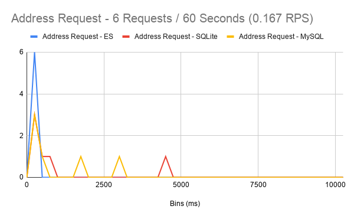
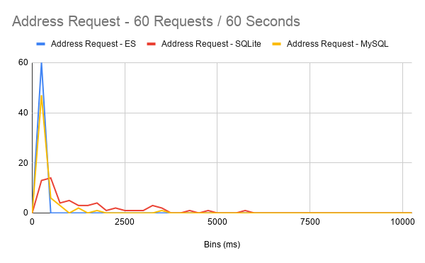
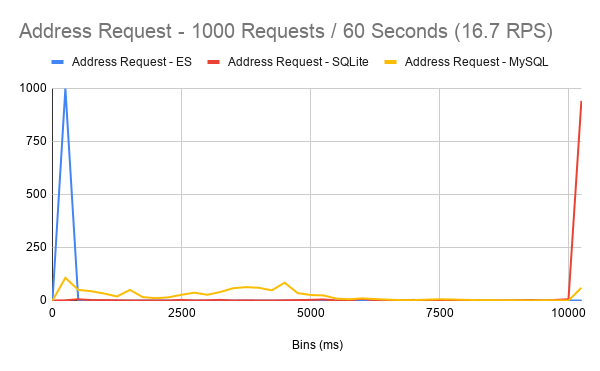

# Autocomplete Address

*Project*: (auto)Complete Me - A SQL vs. ElasticSearch project.

*Author*: Emil Heineking <ebheineking@gmail.com>

## Problem Domain

All e-commerce companys need to collect a customer's address to complete
a sale. The conventional wisdom is that conversion rates will improve when
friction is reduced.

Reducing friction is usually achieved by eliminating as many form fields
as possible. This approach works for the majority of uses but not all.
Eliminating too many fields can exclude certain users and reduce quality
of information collected.

I initially thought that the address field could be collapsed into one
field. I think that address quality would go down which would affect
our ability to deliver the product to the customer.

Providing an autocomplete driving by a backend database of addresses
could reduce friction by autocompleting the address for the user. This
also increases the quality of addresses being submitted by the user.

This project is motivated by this conjecture. I will explore the
differences between implementing a solution powered by a SQL database
and another one powered by ElasticSearch.

## Goals

* User has near instant search results as typing in the street address
* The API can handle many simultaneous users (scalability) 
* Application is easily deployable

## Technical Stack

Platforms
- SQLite3
- ElasticSearch
- MySql
- Node.js
- Typescript

Frameworks
- Express
- Vue.js
- Webpack

DevOps
- Docker

## Moving Forward

* WebSocket might provide better performance
* IP to Geolocation database (maxmind)
* JavaScript Gelocation API
* OpenAddress.io datasource to complement NAD address database

## Datasources

The data is sourced from the National Department of Transportation. The
department is starting a national address database (NAD). At the time
of writing, there were ~36 million addresses usable for this project.

## Performance

  
|        | Address Request - ES | Address Request - SQLite | Address Request - MySQL |
| -----: | -------------------: | -----------------------: | ----------------------: |
|   Mean |               137.67 |                   484.17 |                  550.17 |
| Median |                76.50 |                   234.00 |                  200.00 |
|    Min |                52.00 |                    90.50 |                   65.75 |
|    Max |               422.00 |                 1,873.00 |                1,552.00 |
|    25% |                52.25 |                    90.50 |                   65.75 |
|    75% |               135.25 |                   403.00 |                1,017.50 |

---

  
|        | Address Request - ES | Address Request - SQLite | Address Request - MySQL |
| -----: | -------------------: | -----------------------: | ----------------------: |
|   Mean |                55.63 |                 1,324.78 |                  213.27 |
| Median |               121.00 |                   609.00 |                   82.50 |
|    Min |                14.00 |                     6.00 |                   16.00 |
|    Max |               519.00 |                 6,141.00 |                2,602.00 |
|    25% |                27.75 |                   315.50 |                   43.00 |
|    75% |                63.00 |                 1,757.00 |                  215.25 |

---

 
|        | Address Request - ES | Address Request - SQLite | Address Request - MySQL |
| -----: | -------------------: | -----------------------: | ----------------------: |
|   Mean |                37.25 |                27,200.08 |                1,389.51 |
| Median |                25.00 |                30,304.50 |                  321.50 |
|    Min |                 4.00 |                    84.00 |                    4.00 |
|    Max |             1,360.00 |                35,652.00 |               14,944.00 |
|    25% |                28.00 |                   314.25 |                   47.75 |
|    75% |                39.00 |                33,269.00 |                1,390.50 |

## Closing Thoughts

A/B testing is crucial! Sometimes counter-intuitive results happen.

## Sources:

https://www.ventureharbour.com/how-form-length-impacts-conversion-rates/

https://baymard.com/blog/checkout-flow-average-form-fields

https://www.transportation.gov/gis/national-address-database/national-address-database-0

https://docker-curriculum.com/

https://nodejs.org/de/docs/guides/nodejs-docker-webapp/

https://www.elastic.co/guide/en/elasticsearch/reference/current/getting-started.html

https://app.pluralsight.com/library/courses/jmeter-getting-started

https://en.wikipedia.org/wiki/Words_per_minute

https://www.livechatinc.com/typing-speed-test/#/

http://mysql.rjweb.org/doc.php/latlng